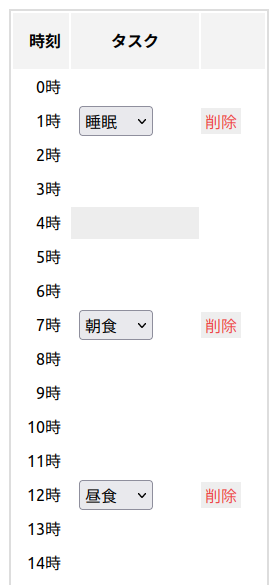

# React with Classes

UIにReactを使い、データの表現としてイミュータブルクラスを使う、という構成のウェブアプリのサンプル

- Reactは関数コンポーネントとHooksを使う (クラスコンポーネントは使わない)
- サンプルの題材がいまいちで、サンプルとしてよくできたものにはなっていない

## モチベーション

- 状態の表現にプレインなオブジェクト (`{}` で表現される型) を使うとカプセル化がなく、あらゆる場所でデータの操作ができてしまう
    - データの変更操作は非破壊更新なのでローカルであるが、データがどういう操作をされるのかというのが把握しづらくなる
- クラスのフィールドをすべてpublicにしてプログラミングするのと同じ状況に陥っている
- データの表現にイミュータブルなクラスを使うことで表現の隠蔽を行い、データの流れを把握しやすくする
- それによってReactのuseMemoなどの機構と悪い相互作用をしないこと

## 作るもの

サンプルとしてスケジュール帳のようなアプリを作る

ページは `/` のみ。そこに1日のスケジュールを記述するページがある。
ページ内には時刻ごとにタスクを設定できる (エントリと呼ぶ)。
エントリは1時間単位で記入する

    state: {
        entries: { 時刻, タスク }[]
    }

## 関連リンク

- [💣Webフロントエンドにおける関数型「風」プログラミングに関する個人的まとめ](https://qiita.com/u83unlimited/items/834131fba97438323706)
