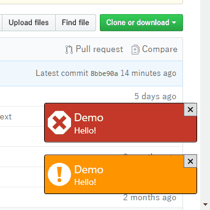

# DotNetKit.Wpf.ToastNotification

A toast notification library for WPF.

## Usage
### SimpleToastNotification
It's easy to use `SimpleToastNotification`.

0. Merge a ResourceDictionary into ``App.Resources``. See [App.xaml](DotNetKit.Wpf.ToastNotification.Demo/App.xaml) for details.
0. Instantiate ``ToastNotificationCollection``, a collection of toast notifications.
0. Initialize and show a window of ``ToastNotificationWindow`` to display the collection.
0. Instantiate `SimpleToastNotification`, which represents a toast notification.
0. Add it to the collection.

See the Demo project for defails.

#### Command
When a toast notification is clicked or tapped, the command from `Command` property is executed.

### Customize ToastNotification
The toast notification window can display customized toast notifications.

0. Prepare the collection and the toast notification window as above.
0. Define a concrete class derived from `ToastNotification`. It's the data context for the notification.
0. Add `DataTempate` to display the notification to ``App.Resources``.
0. Instantiate and add it to the collection.

Note that you don't need to merge ``SimpleToastNotificationTemplate.xaml`` into  ``App.Resources`` if you don't use `SimpleToastNotification`.

## License
[MIT License](LICENSE.md)
