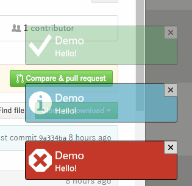

# DotNetKit.Wpf.ToastNotification

A toast notification library for WPF.

## Usafe
### SimpleToastNotification
It's easy to use `SimpleToastNotification`.

0. Merge a ResourceDictionary into the resource dictionary of `App`. See [App.xaml](DotNetKit.Wpf.ToastNotification.Demo/App.xaml) for details.
0. Instantiate an instance of ``ToastNotificationCollection``, which is a collection of toast notifications.
0. Initialize a window of ``ToastNotificationWindow`` and show it. It displays the collection.
0. Create a toast notification of `SimpleToastNotification`.
    - `Command` (ICommand) is executed when the notification is clicked or tapped.
0. Insert it to top of the collection.

See the Demo project for defails.

### Customize ToastNotification
The toast notification window can display customized toast notifications.

0. Prepare the collection and the toast notification window as above.
0. Define a class derived from `ToastNotification`. It's the data context for the notification.
0. Write `DataTempate` to display the notification in ``App.Resources``.
0. Instantiate it and insert into the collection.

## License
[MIT License](LICENSE.md)
