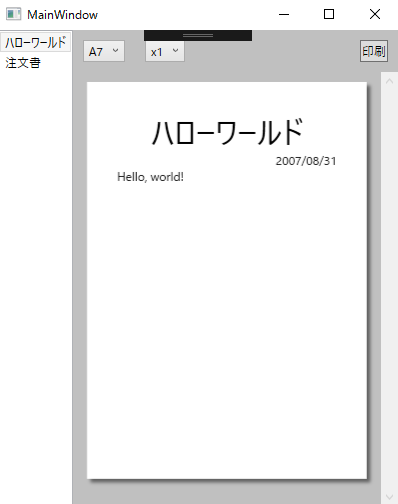

# WPF/XAMLで帳票のデザイン・印刷を行う

※これは [XAML Advent Calendar 2016](http://qiita.com/advent-calendar/2016/xaml) の **25** 日目の記事です。

WPF/XAML を使って帳票のデザインから印刷までやってみたという話です。ソースコードが GitHub にありますので、それと同様にやればできます。

[vain0/VainZero.WpfReportPrinting: WPFで帳票を作成するサンプル](https://github.com/vain0/VainZero.WpfReportPrinting)

## 要約
- XAML というマークアップ言語で帳票のデザインを作りたいと思ったよ。
- WPF アプリケーションで帳票のプレビューや印刷を行うサンプルを作ったよ。
- ページネーションが大変だったけどなんとかなったよ。

## 前提知識
XAML、WPF について簡単に説明します。

XAML とは、GUIアプリケーションの外観を記述するマークアップ言語です。WEB 系の人には「HTML+CSS みたいなもの」といえばイメージしやすいのではないでしょうか。HTML と CSS の疎結合性を捨てた代わりに、テーブルレイアウトとかが標準でサポートされていて作りやすいなどの利点があります。

WPF とは、XAML と .NET 言語 (C# など) を用いて、Windows PC 用のネイティヴ アプリケーションを作るためのフレームワークです。XAML は WPF 以外でも使いますが、筆者は WPF にしか詳しくないので、ひとまず本稿のターゲットは WPF のみとします。

## 簡単な帳票
まずは簡単な帳票を例に挙げて、印刷する方法まで一通り解説します。簡単な帳票とは、タイトルがどーんとあって、日付が右寄せで、あとは本文という感じです。まずはプレビュー画面のスクリーンショットをご覧ください。



ビューモデルと XAML は次のようになっています。UI要素はプレビュー用と印刷用の2つ (以上) をインスタンス化する必要があるので、 DataTemplate の形で定義しています。

```csharp
// 印刷するページに対応するビューモデル。
// データをXAML側に埋め込んでしまったので中身がない。
public sealed class HelloWorldPageViewModel
{
}
```

```xaml
<!--
    上記のビューモデルの表示方法を定義するテンプレート。
    Window.Resources プロパティの下に配置する。
-->
<DataTemplate DataType="{x:Type local:HelloWorldPageViewModel}">
    <Grid Margin="30">
        <StackPanel>
            <TextBlock HorizontalAlignment="Center" FontSize="30" Text="ハローワールド" />
            <TextBlock HorizontalAlignment="Right" Text="2007/08/31" />
            <TextBlock Text="Hello, world!" />
        </StackPanel>
    </Grid>
</DataTemplate>
```

### プレビュー
帳票のデザインが終わったので、次はプレビューです。

プレビューは、簡単にいえば、上に書いた XAML を「紙っぽいパネル」に載せるだけです。紙っぽさの演出についてはソースコードを参照してください。

ここで重要なのは紙のサイズ (A4 とか) です。というのも、ページネーションや文章の折り返しなどが用紙サイズに依存してしまうため、プレビュー時点で用紙サイズを決定しておくのが無難です。(もちろんプレビューをしないというのも1つの手です。)

用紙サイズ (mm 単位) から要素のサイズを換算するには、dpi を知る必要がありますが、ここで嬉しいお知らせがあります。後述するように、印刷時にはUI要素を FixedDocument というクラスの子孫要素に配置するのですが、FixedDocument の中身は 96dpi で固定されます。すなわち、FixedDocument の中身 (印刷するデータ) を 96dpi 決め打ちで作成しておけば、その FixedDocument を 600dpi のレーザープリンターに送信しても、同じ見栄えのものが印刷されるようになっています。 (参考: [WPF のドキュメント](https://msdn.microsoft.com/ja-jp/library/ms748388%28v=vs.110%29.aspx?f=255&MSPPError=-2147217396))

要するに、印刷するデータは 96dpi で作ればよいわけです。

例えば A4 (縦) は、国際規格で 210mm×297mm と決まっており、1 inch = 25.40 mm 、1 inch = 96 pixel で換算すれば 793.70×1122.52 となります。このサイズで作った紙風のパネルに上述の Grid を配置すれば、実際に印刷されるのと同じ見栄えのプレビューを表示できます。

次は印刷です。

### プリンターの選択
どのプリンターで印刷するかは、ユーザーに選択させる方法と、プログラム側で指定する方法の2通りがあります。

ユーザーに選択させる場合は、 ``System.Windows.Controls`` 名前空間の `PrintDialog` クラスを使います。(参考: [PrintDialog クラス (System.Windows.Controls)](https://msdn.microsoft.com/ja-jp/library/system.windows.controls.printdialog%28v=vs.110%29.aspx?f=255&MSPPError=-2147217396)) なお、プレビュー画面で選択された用紙サイズを印刷ダイアログの初期設定値にする方法は ~~時間が足りず調べられていません~~ 読者の演習課題とします。

```csharp
using System.Windows.Controls;

{
    var printDialog = new PrintDialog();
    var result = printDialog.ShowDialog();
    if (!result.HasValue || !result.Value)
    {
        // 印刷ダイアログがキャンセルされた。
        return;
    }

    // 後の工程で使用する。
    var queue = printDialog.PrintQueue;
}
```

プログラム側で指定する場合は、プリントサーバーというのを使用するようです。詳しくは読者の演習課題とします。ここでは、コンピューター自身を表すサーバー (localhost みたいなもの) である `LocalPrintServer` から、デフォルトのプリンターを指定する方法をとります。

```csharp
// System.Printing を参照に追加する必要があります。
using System.Printing;

public void Print(Size pageSize)
{
    var printServer = new LocalPrintServer();

    // 既定のプリンターを表す PrintQueue を取得する。
    var queue = printServer.DefaultPrintQueue;

    // プレビュー画面で用紙サイズを選択させる場合は、用紙サイズを設定しておく。
    var ticket = queue.PrintTicket;
    ticket.PageMediaSize = new PageMediaSize(pageSize.Width, pageSize.Height);;
}
```

### FixedDocument の生成
先述の通り、印刷するデータを持つ FixedDocument のインスタンスを用意します。この作業は再利用可能な形式にしてあります。

まず「印刷するデータをページに分割する」機能 (ページネーション) を表現するインターフェイスを定義しておきます。IPaginatable と呼びましょう。

```csharp
using System.Windows;

public interface IPaginatable
{
    /// <summary>
    /// ページのサイズを受け取って、オブジェクトのリストを返す。
    /// リストに含まれる各オブジェクトは、それぞれ1つのページの中身を表す。
    /// </summary>
    IReadOnlyList<object> Paginate(Size pageSize);
}
```

いま例にとっているハローワールド帳票では、常に1つのページになりますので、Paginate メソッドは1つのオブジェクトを返せばよいわけです。次のようになります。 [^ireport]

[^ireport]: GitHub においてあるソースコードでは、HelloWorldReport は IPaginatable だけでなく、IPaginatable を拡張する IReport というインターフェイスを実装していますが、それはサンプルのためです。あまり気にしなくてかまいません。

```csharp
public sealed class HelloWorldReport
    : IPaginatable
{
    IReadOnlyList<object> Pages { get; } =
        new object[]
        {
            new HelloWorldPageViewModel(),
        };

    public IReadOnlyList<object> Paginate(Size size)
    {
        return Pages;
    }
}
```

あとは次の拡張メソッドを呼ぶだけです。Paginate メソッドが返したリストにつき、各オブジェクトを固定サイズの ContentPresenter に入れて、それを FixedPage に入れて、それを PageContent に入れて、それを FixedDocument に追加する、という感じです。

```csharp
public static class PaginatableExtension
{
    public static FixedDocument
        ToFixedDocument(this IPaginatable paginatable, Size pageSize)
    {
        var document = new FixedDocument();

        foreach (var content in paginatable.Paginate(pageSize))
        {
            var presenter =
                new ContentPresenter()
                {
                    Content = content,
                    Width = pageSize.Width,
                    Height = pageSize.Height,
                };

            var page =
                new FixedPage()
                {
                    Width = pageSize.Width,
                    Height = pageSize.Height,
                };
            page.Children.Add(presenter);

            // この3つを行わないと DataGrid がページ全体に展開せず、潰れた状態になる。
            // これらが実際に何をするかは余裕があったら調べたい。
            page.Measure(pageSize);
            page.Arrange(new Rect(new Point(0, 0), pageSize));
            page.UpdateLayout();

            var pageContent = new PageContent() { Child = page };
            document.Pages.Add(pageContent);
        }

        return document;
    }
}
```

こうして FixedDocument を手に入れました。

### XpsDocumentWriter で印刷する
最後に、この FixedDocument を、選択されたプリンターに送信すれば完了です。

```csharp
// System.Printing の参照を追加する必要があります。
using System.Printing;

{
    var writer = PrintQueue.CreateXpsDocumentWriter(queue);
    writer.Write(document);
}
```

できました。

## ページネーションを含む帳票
次に複雑な帳票、というかページネーションの方法を解説します。

まずはプレビュー画面のスクリーンショットをごらんください。


XAML は結構な分量なので省略します。明細の部分には、スタイルをガチガチに決めた DataGrid を使用しています。

簡単な帳票との差は、Paginate メソッドの実装だけです。

### Paginate
ここでは実際に DataGrid をインスタンス化することでページネーションを行います。(というか、それ以外にうまい方法があるのでしょうか。)

おおまかな手順は次の通りです。

0. すべての行のデータを持った DataGrid を生成する。
0. 「スクロールなしで見えている行の数」を数えて、その範囲の行からなるページを生成する。
0. 1ページ分スクロールして、また「見えている行の数」を数える。繰り返し。

実際のソースコードはやや長いので、最初に張ったリンクから見てもらえればと思います。

注意点は2つあります。

- DataGrid を初期化した後、画面サイズに合わせてレイアウトを再計算させる必要がある。

```csharp
    // ページネーションを行うために、実際に DataGrid を生成する。
    var preview = new OrderFormPage(Header, Items);
    var presenter =
        new ContentPresenter()
        {
            Content = preview,
            Width = size.Width,
            Height = size.Height,
        };

    // DataGrid のレイアウトを計算させる魔法のコード
    presenter.Measure(size);
    presenter.Arrange(new Rect(new Point(0, 0), size));
    presenter.UpdateLayout();
```

Measure, Arrange, UpdateLayout の3つを起動することで、DataGrid が余白に合わせて適切なサイズに広がります。

- 「見えている行の数」の代わりに、「見える行数の最大値」である ``ScrollViewer.ViewportHeight`` が使用できる。(「見えている行の数」を厳密に取得する方法 ~~が分からなかった……~~ は読者の演習課題)

DataGrid のデフォルトの見た目では、中身をスクロールできるように ScrollViewer が配置されていて、「見える行数の最大値」のような情報を取得するには、それのプロパティを見ればいいわけです。問題となるのは、ScrollViewer のインスタンスをどう捕まえるかなのですが、VisualTree を辿るのが1つの方法です。これについては、参考リンクにあるブログ記事を参照してください。(あるいはソースコードを参照。)

## 参考リンク
### 帳票関連
- [WPFを帳票フレームワークとして使う - @kotyのブログ](http://koty.hatenablog.com/entry/2013/12/15/122352)

### WPF関連
- [c# - Check visible rows in a WPF DataGrid - Stack Overflow](http://stackoverflow.com/a/7601504/6419575)
- [VisualTreeの子孫要素を取得する - xin9le.net](http://blog.xin9le.net/entry/2013/10/29/222336)
